# HİSAR — Arayüz Kullanım Kılavuzu

Sürüm 2.0 · 26 Eylül 2026

Bu kılavuz, sivil alan güvenliği bağlamında kullanılan uygulamanın ekranlarını ve mevcut kontrollerini açıklar. Ekrandaki adlar, uygulamayla eşleştirmeyi kolaylaştırmak için aynen korunmuştur. Değerlendirme, müdahale veya risk seviyesi seçme önerisi verilmez.

## 1. Ekranı tanıma

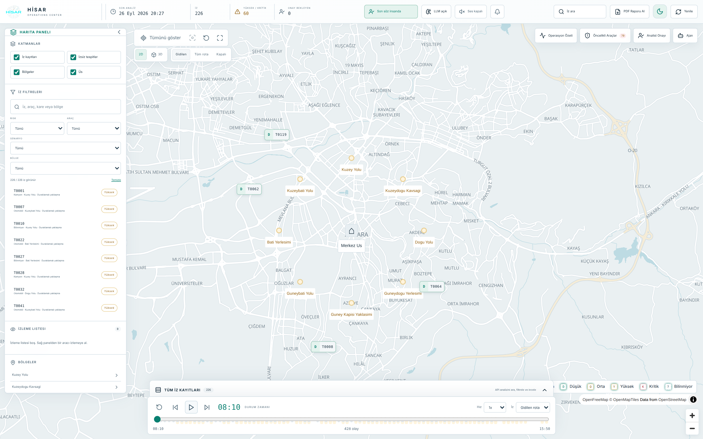

**Üst çubuk:** Uygulama adı, son analiz zamanı, sayaçlar, durum göstergeleri ve genel düğmeler burada bulunur.

**Sol panel:** Katmanlar, arama, harita filtreleri, izleme listesi, bölgeler ve izsiz tespitler bu alandadır. Panel başlığındaki ok görünürlüğünü değiştirir.

**Harita:** Merkezdeki çalışma alanıdır. Sol üstte harita araçları; sağ üstte açılır panel düğmeleri; sağ altta yakınlaştırma kontrolleri bulunur.

**Alt alan:** Tüm İz Kayıtları açılır tablosu ve zaman çizelgesi burada yer alır. Birbirlerinden bağımsız kontrollerdir.

**Sağ detay paneli:** Bir kayıt seçildiğinde açılır. Başlıktaki kimlik hangi kaydın görüntülendiğini belirtir. Panel içeriği dikey kaydırılabilir.

**Adlandırma:** İz/track bir hareket kaydını, kare bir görüntü kaydını, araç kimliği bir tespit kaydını ifade eder. Bunlar her zaman bire bir aynı nesne değildir. “Üs” etiketi uygulamanın merkez referans noktasının mevcut adıdır; kılavuzda etiket değiştirilmemiştir.

## 2. Üst çubuk ve genel düğmeler

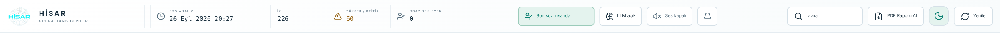

**HİSAR logosu:** Uygulama kimliğini gösterir; bu görünümde ayrı bir sayfaya götüren menü düğmesi değildir.

**Son analiz:** Ekrana yüklenen analiz verisinin üretim zamanını gösterir. Zaman çizelgesinin “Durum zamanı” alanıyla aynı bilgi değildir.

**İz / Yüksek-Kritik / Onay bekleyen:** Veri özetindeki sayıları gösteren bilgi alanlarıdır. Sayının üzerine basmak otomatik olarak filtre uygulamaz.

**Son söz insanda:** Sunucudaki insan onayı ayarını değiştirir. İşlem sırasında anahtar devre dışı kalır. Görünüm tercihi değildir; yalnızca ekranı incelerken değiştirmek gerekmez.

**LLM açık / kapalı:** Model durumunu gösteren rozettir. Üzerindeki açıklama model bilgisini gösterebilir. Bu rozet modeli açıp kapatan bir düğme değildir.

**Ses açık / kapalı:** Sesli bildirim tercihini değiştirir. Ayrıntılar ses kontrolleri bölümündedir.

**Zil:** İzleme listesi bildirim panelini açar veya kapatır. Varsa rozette okunmamış bildirim sayısı görünür.

**İz ara:** Sol paneli açar ve arama kutusuna odak verir. Tek başına bir filtre seçmez.

**PDF Raporu Al:** Rapor üretim adresini yeni sekmede açar. Harita veya alt tablo filtrelerinin PDF'ye aynen aktarılması anlamına gelmez.

**Güneş / ay:** Açık ve koyu görünüm arasında geçiş yapar. **Yenile:** Analiz verisini yeniden yükler; bu sırada “Yenileniyor…” ve dönen simge görünür. Başarısız yenilemede önceki başarılı veri ekranda kalabilir. Görünen “Tekrar dene” düğmesi veri isteğini yeniden başlatır.

## 3. Haritada gezinme

**Tümünü göster:** Veri kümesinin genel harita sınırlarını yeniden kadraja alır. Harita aramasını veya filtreleri temizlemez.

**Seçili track'e odaklan:** Seçili kaydın durum zamanındaki konumuna gider. Seçim yoksa düğme devre dışıdır. Bu düğme ile detay panelindeki “Haritada odaklan” aynı yerde bulunmaz ve kamera takibine etkileri farklı olabilir.

**Harita yönünü sıfırla:** Yön ve eğimi sıfırlar; ardından genel görünümü kadraja alır. Yalnızca pusula yönünü değiştiren bir kontrol değildir.

**Tam ekran harita:** Harita kapsayıcısını tarayıcının tam ekran görünümüne geçirir. Kontrol “Tam ekrandan çık” olur; yeniden basarak veya tarayıcının Escape davranışıyla çıkılabilir. Destek yoksa düğme devre dışıdır. Tüm uygulama panellerinin tam ekrana taşınacağı varsayılmamalıdır.

**+ / −:** Yakınlaştırır ve uzaklaştırır. Fareyle sürükleme harita alanını taşır; tekerlek yakınlaştırmayı değiştirir. İmleç bir kaydırılabilir panel üzerindeyken panel hareket edebilir.

**Harita işaretçileri:** Kayıt işaretçisi seçimi detay panelini açabilir. Bölge ve merkez işaretçileri farklı veri türleridir; hepsi aynı detay görünümünü açmaz.

**Alt bilgi bağlantıları:** Harita sağlayıcısı ve veri atıflarıdır. Uygulamanın filtre veya katman kontrolleri değildir.

## 4. Perspektif ve rota görünümü

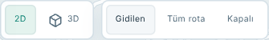

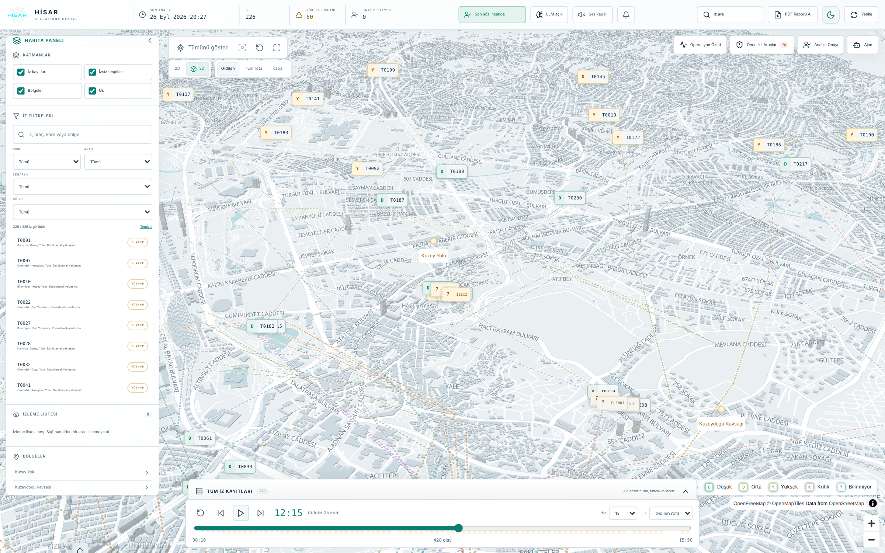

**2D:** Haritayı düz görünümde sunar. **3D:** Eğik perspektife geçirir ve mevcut bina katmanının üç boyutlu görünümünü etkinleştirir. Görüntünün bir fotoğraf veya canlı kamera yayını olduğu anlamına gelmez.

**Gidilen:** Rota çizimini seçili durum zamanına kadar gösterir. **Tüm rota:** Mevcut kaydın bütün rota çizimini gösterir. **Kapalı:** Rota çizimini gizler; kaydı veya veri kümesini silmez.

**Ortak kontrol:** Haritadaki rota düğmeleri ile zaman çizelgesindeki “İz” açılır listesi aynı görünüm durumuna bağlıdır. Birindeki değişiklik diğerinde de görünür.

**Görünüm ve veri ayrımı:** Perspektif, yakınlaştırma ve rota görünümü seçenekleri sunum kontrolleridir. Mevcut analiz sonucunu yeniden hesaplatmazlar.

## 5. Sol panel ve katmanlar

**Daralt / aç:** Başlıktaki sola bakan ok paneli daraltır. Sol kenardaki katman ve ok simgesi paneli geri açar. Panel görünürlüğünü değiştirmek kayıtları silmez.

**İz kayıtları katmanı:** Haritadaki iz işaretçilerinin görünürlüğünü yönetir. **İzsiz tespitler:** İzle eşleşmemiş tespitlerin görünürlüğünü yönetir. **Bölgeler:** Bölge işaretlerini gösterir veya gizler. **Üs:** Merkez referans işaretini gösterir veya gizler.

**Katman kutuları:** İşaretli kutu ilgili katmanın açık olduğunu belirtir. Bir kutuya basmak yalnızca ilgili görünürlük durumunu değiştirir; arama metnini temizlemez. Katman kapalıyken kaydın haritada görünmemesi verinin silindiğini göstermez.

**Bölgeler listesi:** Bir bölge satırı harita görünümünü o bölgeye götürür. Filtre alanındaki “Bölge” seçimi ise listeyi daraltır; iki kontrol aynı işlem değildir.

**İzsiz tespitler listesi:** Tespit kimliği, sınıfı ve çekim zamanı gibi bilgileri sunar. Satırın açılması görüntüleme zamanını ve harita odağını ilgili kayda taşıyabilir. Bu kayıt için mutlaka bir iz detay paneli oluşması beklenmemelidir.

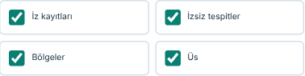

**Kaydırma:** Sol panelin içerik alanı kendi içinde kaydırılır. Alt bölümler görünmüyorsa panel içinde aşağı ilerleyin.

## 6. Harita araması ve filtreler

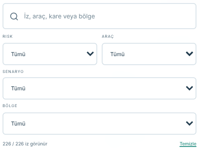

**Arama kutusu:** İz kimliği, araç/kare kimliği, araç sınıfı veya bölge metninde eşleşme arar. Metnin başındaki ve sonundaki boşluklar dikkate alınmaz; büyük-küçük harf normalleştirilir.

**Risk / Araç / Senaryo / Bölge:** Her açılır liste kendi alanına göre sonuçları daraltır. “Tümü” o alanın kısıtını kaldırır. Senaryo ve bölge seçenekleri mevcut veriye göre değişebilir.

**Birlikte kullanım:** Birden fazla filtre seçildiğinde kayıt bütün koşulları sağlamalıdır. Arama metni de aynı anda geçerlidir. Boş sonuç, yalnızca bu koşullarla eşleşme bulunmadığını gösterir.

**Sonuç sayacı:** Eşleşen ve toplam kayıt sayısını gösterir. Sol sonuç listesi ile haritadaki iz görünürlüğü bu filtrelerle ilişkilidir; genel özet sayaçları otomatik olarak filtre sonucu sayısına dönüşmez.

**Temizle:** Harita aramasını ve harita filtrelerini başlangıç durumuna döndürür. Katman görünürlüğünü, izleme listesini veya alt tablonun ayrı filtrelerini sıfırlamaz.

**Sonuç satırı:** İlgili kaydı seçer ve detay görünümünü açar. Alt tablodaki filtrelerden bağımsızdır. Arama işlevi yalnızca metin eşleştirmedir; doğal dilde değerlendirme yapan Ajan sohbetinden farklıdır.

## 7. Zaman çizelgesi

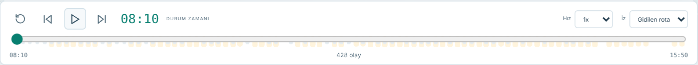

**Başa al:** Durum zamanını veri aralığının başlangıcına getirir ve oynatımı duraklatır.

**Önceki / sonraki adım:** Zamanı beş dakika geri veya ileri taşır; oynatımı duraklatır. Aralığın başlangıç ve bitiş sınırları aşılmaz.

**Oynat / duraklat:** Zamanın otomatik ilerlemesini başlatır veya durdurur. Veri aralığının sonuna ulaşıldığında durur. Sondayken yeniden oynatılması başlangıçtan başlatır. Tek bir zaman noktası varsa düğme kullanılamaz.

**Durum zamanı:** Görüntülenen oynatma anıdır; bilgisayar saati veya son analiz zamanı değildir.

**Hız:** 0,5x, 1x, 2x ve 4x seçenekleri vardır. Mevcut uygulamada 1x, gerçek bir saniyede kayıt zamanını 60 saniye ilerletir. Dolayısıyla “1x” gerçek zamanlı canlı akış anlamına gelmez.

**Zaman sürgüsü:** Başlangıç ve bitiş arasında belirli bir ana gider. Sürgü hareketi oynatımı her durumda duraklatmaz; sabit bir anı incelemek için önce duraklatmak gerekir.

**İz:** Gidilen rota, Tüm rota ve Kapalı seçenekleri haritadaki eşdeğer düğmelerle senkron çalışır.

**Olay işaretleri:** İşaretin açıklaması olayın metnini ve saatini gösterir. Basıldığında ilgili zamana gidilir. Alt kısımda zaman sınırları ve olay sayısı yer alır.

**Görüntülenen veriler:** Zaman değişimi haritadaki konumu, rota çizimini ve zamana bağlı detayları etkiler. Analiz rozetlerinin her oynatma anında yeniden hesaplandığı varsayılmamalıdır.

## 8. Tüm İz Kayıtları tablosu

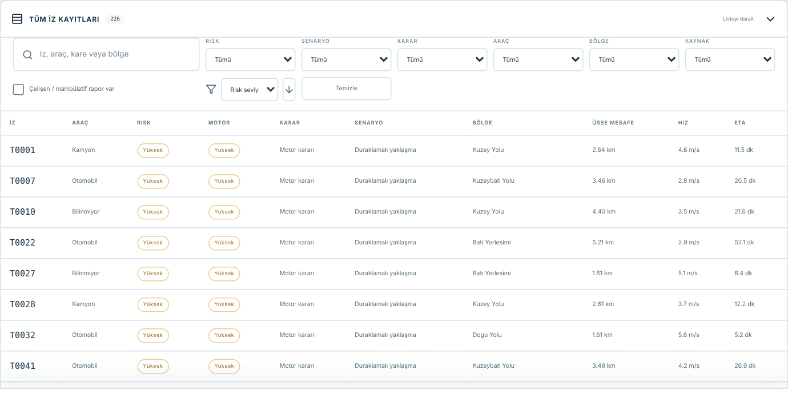

**Paneli aç / daralt:** “Tüm İz Kayıtları” çubuğuna basmak tabloyu açar; aynı çubuk yeniden daraltır. Sağdaki ok mevcut durumu gösterir.

**Tablo araması:** İz, araç, kare veya bölge metnini arar. Harita panelinin arama kutusundan bağımsızdır.

**Filtreler:** Risk, Senaryo, Karar, Araç, Bölge ve Kaynak alanları vardır. Hepsi birlikte uygulanır. “Çelişen / manipülatif rapor var” kutusu ilgili rapor etiketini taşıyan kayıtları listeler; yeni rapor analizi başlatmaz.

**Sıralama:** Açılır listede risk seviyesi, üsse mesafe, gözlem zamanı veya tahmini varış seçilir. Yanındaki ok yönü değiştirir. Sıralama kayıt içeriğini değiştirmez; eşitlik durumunda kimlik sırası kullanılabilir.

**Temizle:** Tablo aramasını, altı filtreyi ve rapor kutusunu sıfırlar. Mevcut sıralama seçimini sıfırlamaz. Sol panelin filtrelerine müdahale etmez.

**Sütunlar:** İz, Araç, Risk, Motor, Karar, Senaryo, Bölge, Üsse mesafe, Hız, ETA, Gözlem, Kaynak ve Rapor. ETA tahmini varış süresi alanıdır. Kaynak etiketleri “Karede tespit edildi”, “İzden kurtarıldı (model kaçırmış)” veya “Kare dışı iz” olabilir; bunlar farklı veri bağlantılarını ifade eder. Yatay kaydırmayla sağdaki sütunlara ulaşılabilir. “—” eksik veya sunulmayan değeri belirtir; sıfırla aynı değildir.

**Satır seçimi:** Satıra tıklamak veya klavyeyle odaklanıp Enter/Boşluk kullanmak detay görünümünü açar. Seçili satır vurgulanır.

**Panelin yeniden açılması:** Alt tablo kapatıldığında bileşen kaldırılır. Yeniden açıldığında bu tabloya ait arama, filtre ve sıralama tercihleri başlangıç durumuna dönebilir.

## 9. Detay panelinin kontrolleri

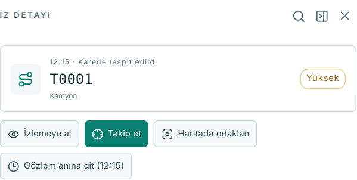

**Yazı boyutu:** Başlıktaki büyüteç görünümlü kontrol bu panelde metin aramaz; Varsayılan → Büyük → Çok büyük boyutları arasında döner. Tercih aynı tarayıcı profilinde saklanır.

**Detay panelini daralt:** Paneli gizler, seçimi temizlemez. Aynı kaydı yeniden seçmek paneli açar. **İz seçimini temizle (X):** Seçimi kaldırır ve kamera takibini kapatır. Panel dışındaki karartılmış alana basmak da seçimi temizleyebilir.

**İzlemeye al / İzleniyor:** Kaydı yerel izleme listesine ekler veya çıkarır. Bu kontrol ile “Takip et” farklıdır.

**Takip et:** Harita kamerasının seçili kaydı izlemesiyle ilgilidir. Kayıt zaman içinde hareket ettikçe kamera odağı güncellenebilir. Yeniden basıldığında takip kapanır.

**Haritada odaklan:** Detay panelinden seçili kayda odaklanma isteği gönderir. Mevcut uygulamada bu işlem kamera takibini de etkinleştirebilir. Üst harita araç çubuğundaki odak düğmesiyle bire bir aynı davranış varsayılmamalıdır.

**Gözlem anına git:** Kayıtta gözlem zamanı varsa görünür. Zaman çizelgesini o ana götürür ve harita odağını günceller.

**Bölüm başlıkları:** Başlığın yanındaki ok ilgili içerik bölümünü açar veya daraltır. Yalnızca görünümü değiştirir; kaydı değiştirmez.

## 10. Detay panelindeki bilgi bölümleri

**Risk Kararı:** Mevcut sonuç, motor sonucu, karar durumu ve sunulan gerekçeler gösterilir. Aynı kayıtta farklı kaynakların alanları ayrı yer alabilir. Bu kılavuz hangi seviyenin seçilmesi gerektiğini tarif etmez.

**Senaryo ve Gerekçeler:** Sunucunun kayıt için döndürdüğü senaryo metnini ve gerekçelerini gösterir. Bölümü açmak yeniden hesaplama başlatmaz.

**Gözlem:** Kare kimliği, çekim zamanı, tespit kimliği, sınıf ve varsa tespit güveni gibi gözlem alanlarını içerir. Kare dışı kayıtta bunun yerine son nokta ve konum alanları görülebilir.

**Hareket Öznitelikleri:** Veride mevcut ölçüm alanları ve zaman penceresi sunulur. Görüntüleme zamanındaki konum ile özet ölçüm penceresinin aynı olması zorunlu değildir.

**Ajan Değerlendirmesi:** Varsa mevcut değerlendirme, kaynak/model bilgisi, zamanı ve açıklamalar gösterilir. “Kareyi ajanla değerlendir” veya “Yeniden değerlendir” düğmeleri yeni sunucu işlemi başlatır; yalnızca görüntüleme kontrolü değildir. Kare bağlantısı olmayan kayıtta açıklayıcı boş durum gösterilir.

**Anlık Konum:** Durum zamanına göre enlem, boylam ve konum bilgilerini gösterir. Zaman kaydın başlangıcından önceyse “İz henüz başlamadı” görülebilir. “Son bilinen konum” etiketi yeni bir gözlem bulunduğu anlamına gelmez.

**Saha Raporları:** Durum zamanına kadar görünür olan raporları listeler. Görünen/toplam sayı bu nedenle değişebilir. Metin, özet ve kaynak alanları ayrı sunulur.

**Mesafe Geçmişi:** Zamana bağlı çizgi ve nokta sayısı gösterilir. Grafiğin görünür noktaları oynatma zamanına bağlı olabilir.

**Motor Adımları:** Veride mevcutsa ayrıntılı açıklama adımlarını gösterir. Bu bölümdeki metinler düğme veya kullanıcı komutu değildir.

## 11. Görseller ve rapor ayrıntıları

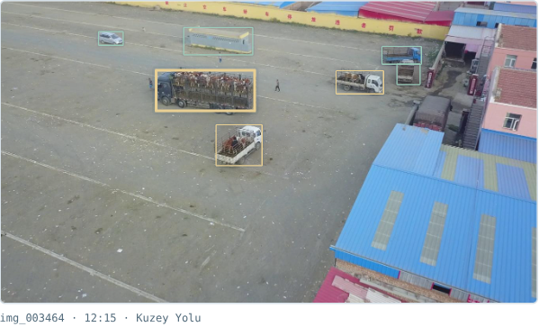

**Kare görüntüsü:** Seçili kaydın ilişkilendirildiği görüntüdür. Yanındaki kare kimliği ve çekim zamanı hangi kayda ait olduğunu belirtir. Oynatma sürgüsünü değiştirmek bu fotoğrafı yeni çekilmiş bir görüntüye dönüştürmez.

**Görüntü üzerindeki kutular:** Uygulamanın karede gösterdiği tespit alanlarıdır. Seçili kayıt farklı biçimde vurgulanabilir. Kutunun göründüğü yerde araç kimliği açıklaması bulunabilir. Fotoğrafı veya kutuları düzenleme özelliği bu ekranda sunulmaz.

**Tespit güveni:** İlgili tespit alanıdır; bağımsız olarak ölçülmüş genel model doğruluğuyla aynı kavram değildir. Bu kılavuz değer için kabul eşiği önermez.

**Rapor kartı:** Kimlik, saat, kaynak, rapor türü, metin ve varsa özet/hüküm etiketi içerir. Görülen etiket, raporun kendisiyle uygulamanın rapora ilişkin değerlendirmesini ayırt etmeyi gerektirir.

**Doğrulama kontrolleri:** Bir raporda kontrol alanları varsa açılır başlık görünür. Başlığa basmak mevcut ayrıntıları açar veya kapatır; yeni kontrol çalıştırmaz.

**Eksik içerik:** Kare, rapor veya zaman eşleşmesi bulunmayan kayıtta ilgili bölüm açıklama metniyle boş olabilir. Kılavuzdaki ekran görüntüsü her kaydın aynı alanlara sahip olacağını garanti etmez.

## 12. İzleme listesi ve bildirimler

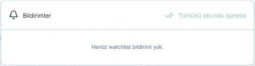

**Listeye ekleme ve çıkarma:** Detay panelindeki “İzlemeye al” düğmesi kayıt için liste üyeliğini değiştirir. Listedeki çöp kutusu yalnızca izleme listesi üyeliğini kaldırır; ana kaydı silmez.

**Listeden açma:** Sol paneldeki izleme satırına basmak o kaydı seçer. Listede görünmek kamera takibinin mutlaka açık olduğu anlamına gelmez.

**Zil rozeti:** Okunmamış bildirim sayısını gösterir. Zil düğmesi paneli açar/kapatır. Panelde en son bildirimlerin bir bölümü gösterilir; mevcut arayüz en fazla 20 satır sunar.

**Bildirim satırı:** Seçildiğinde ilgili bildirim okundu işaretlenir, kayıt seçilir ve bildirim paneli kapanır.

**Tümünü okundu işaretle:** Okunmamış durumlarını temizler. Bildirimleri veya araç kayıtlarını silmez. Okunmamış kayıt yoksa düğme devre dışıdır.

**Ne zaman oluşur:** Listeye alınan kayıtların yeni yüklenen analizlerdeki durumları önceki yerel kayıtla karşılaştırılır. Yalnızca oynatma sürgüsünü hareket ettirmek mutlaka yeni bildirim üretmez.

**Saklama:** İzleme listesi, karşılaştırma bilgileri ve bildirimler aynı tarayıcının yerel depolamasında tutulur. Farklı profil ayrı liste görebilir. Bir kaydı listeden çıkarmak geçmiş bildirimlerini otomatik olarak silmez.

## 13. Sesli bildirim kontrolleri

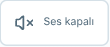

**Ses açık / Ses kapalı:** Üst çubuktaki hoparlör düğmesi sesli bildirim tercihini değiştirir. Kapama, etkin sesli bildirimi durdurma isteği de oluşturur. Tercih aynı tarayıcı profilinde saklanır.

**Sesli uyarı kartı:** Etkin bildirim varsa görünür. Kayıt kimliği, saat, mevcut etiketler, metin ve varsa mesafe/zaman alanları bulunur. Her zaman açık duran bir panel değildir.

**Sesi Kes:** O anki anonsu durdurma isteği gönderir, etkin kartı ve sıradaki anons göstergesini temizler. Üst çubuktaki genel ses tercihini kapatmakla aynı işlem değildir.

**Araca Kilitlen / Kilitlendi:** Kartın konumla ilişkili görüntüleme kontrolüdür. Mevcut kayıt veya koordinat üzerinden harita odağını değiştirir; kayıt kimliği varsa detay seçimi ve kamera takibi de devreye girebilir.

**Oto-Kilit:** Yeni sesli bildirimde otomatik kamera odağı tercihini yönetir. Tercih yerel olarak saklanır. Bu, izleme listesine ekleme düğmesi değildir.

**Sıra göstergesi:** “+N anons sırada” ifadesi varsa bekleyen sesli içerik sayısını gösterir; ayrı bir gönderme düğmesi değildir.

**Belgeleme notu:** Güncel ekran çekiminde etkin sesli kart bulunmadığından örnek bir kart üretilmedi. Bu bölümdeki koşullu kontroller kaynak koddan doğrulandı. Mevcut ekranda ayrıca bir ses seviyesi kaydırıcısı veya sesli bildirim eşiği seçicisi bulunmaz.

## 14. Özet ve liste panelleri

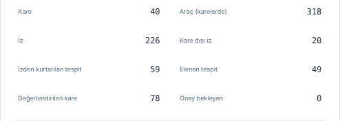

**Operasyon Özeti:** Uygulamadaki mevcut düğme adıdır. Veri sayaçlarını ve dağılımları gösteren açılır paneli açar. Aynı düğmeye yeniden basmak veya X kontrolü paneli kapatır.

**Panel alanları:** Kare, karelerdeki araç, iz, kare dışı iz, kurtarılan/elenen tespit, değerlendirilen kare ve onay bekleyen gibi sayaçlar vardır. Farklı türde kayıtları saydıkları için birbirleriyle aynı olmaları beklenmez. Dağılım satırları bu ekranda filtre düğmesi değildir.

**Riskli kareleri ajanla değerlendir:** Bir sunucu işlemi başlatan düğmedir. İşlem sırasında devre dışı kalır; sonuç veya hata mesajı panelde gösterilir. Kılavuzun ekran çekiminde tetiklenmemiştir.

**Öncelikli Araçlar:** Ayrı bir liste paneli açar. Kimlik, saat, mevcut etiket ve açıklamalar gösterilir. Liste sunucudan gelen uyarı kayıtlarını kullanır; haritanın bütün kayıt listesiyle aynı değildir.

**Liste satırı:** Kayıt veya koordinat odağını ve görüntüleme zamanını değiştirebilir; panel kapanır. Her satırda iz kimliği bulunması zorunlu değildir.

**Panel davranışı:** Özet, liste, onay ve sohbet panelleri aynı açılır panel durumunu paylaşır. Birini açmak önceki paneli kapatır.

## 15. Onay panelindeki alanlar

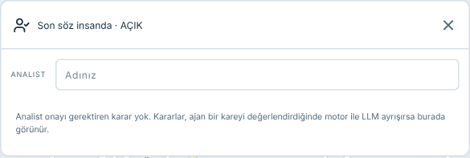

**Analist Onayı:** İlgili kayıtların ve varsa kullanıcı kararlarının bulunduğu paneli açar. Sağ üst X kapatır. Başlıktaki sayı bekleyen kayıtları temsil edebilir; liste daha önce karar verilmiş kayıtları da içerebilir.

**Analist adı:** Kullanıcı kararına eşlik eden isim alanıdır. Ayrı bir oturum açma veya kimlik doğrulama ekranı değildir. Aynı uygulama oturumundaki ilgili formlar bu alanı paylaşır.

**Karşılaştırma kartı:** Kayıt kimliği, güncel durum ve kaynak açıklamaları sunar. Kayıt yoksa panel boş durum açıklaması gösterir.

**Seviye seçenekleri ve not:** İlgili kartta veri ve ayar durumuna göre görünür. Seçim yapmak formun yerel seçimini değiştirir; tek başına kaydetme işlemi değildir. Not alanı isteğe bağlıdır. Bu kılavuz hangi değerin seçileceğine ilişkin yönlendirme içermez.

**Kararı kaydet / Kararı güncelle:** Formdaki bilgileri sunucuya yazan kontrollerdir. **Geri al:** Daha önce kaydedilmiş kullanıcı kararını geri alan işlemdir. Bunlar görünüm ayarı değildir; kılavuz hazırlanırken çalıştırılmamıştır.

**İşlem durumu:** Kayıt işlemi sürerken ilgili gönderme/geri alma kontrolü kullanılamayabilir. Hata kartta gösterilir. İnsan onayı kapalıyken form yerine açıklama görülebilir.

**Koşullu görünüm:** Kart düğmeleri mevcut çekimde görünmediği için bu açıklamalar bileşen kodundan doğrulanmıştır. Görselde bulunmayan bir karar kartı eklenmemiştir.

## 16. Ajan sohbeti

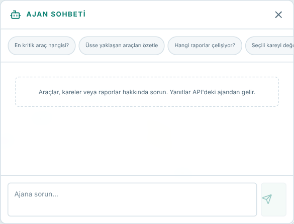

**Ajan düğmesi:** Sohbet panelini açar. Başlıktaki X kapatır. Seçili kaydın kare bilgisi varsa başlıkta bağlam kimliği gösterilebilir.

**Mesaj alanı:** Metin giriş alanıdır. Enter gönderir; Shift+Enter yeni satır açar. Sağdaki gönder simgesi aynı gönderme işlemini yapar. Boş metinde veya yanıt beklenirken gönder düğmesi devre dışıdır.

**Hazır soru düğmeleri:** Üzerindeki metni doğrudan gönderir; yalnızca mesaj kutusuna yazmaz. Birine basmak model/ajan isteği başlatabilir. Kılavuz çekiminde hiçbir soru gönderilmedi.

**Yanıt alanı:** Kullanıcı ve ajan mesajları ayrı etiketlerle görünür. İşlem sürerken “Ajan yanıtlıyor…” gösterilir. Hata varsa panel içinde açıklanır; boş ekran başarılı yanıt alındığını göstermez.

**Kimlik bağlantıları:** Yanıttaki tanınan kayıt veya kare kimlikleri tıklanabilir olabilir. Eşleşme varsa ilgili kayıt/konum ve zaman görünümüne geçilir. Her metin parçası bağlantı değildir.

**Bağlam:** Seçili kare bilgisi istekle birlikte gönderilebilir. Bu nedenle başlıktaki bağlam alanı hangi kaydın seçili olduğunu anlamak için kullanılır.

**Paneli kapatma:** Mevcut uygulamada sohbet bileşeni kaldırılır. Panel yeniden açıldığında görünen mesajlar ve yerel konuşma kimliği sıfırlanır; kalıcı bir sohbet geçmişi ekranı olarak düşünülmemelidir.

## 17. PDF Raporu Al

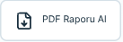

**Kontrolün yeri:** Üst çubukta “PDF Raporu Al” yazısı ve dosya/indirme simgesi bulunur. Dar pencere görünümünde yalnızca simge görülebilir.

**Mevcut davranış:** Düğme rapor üretim adresini yeni sekmede açar. Hazır bir ekran görüntüsünü indirmekten farklı olarak sunucu rapor üretimi çalıştırabilir. Hazırlama süresi veri miktarına ve mevcut yapılandırmaya bağlıdır.

**Filtre ilişkisi:** Güncel düğme isteğinde sabit `min_risk=YUKSEK` parametresi vardır. Sol harita filtreleri, alt tablo araması ve seçili kayıt bu düğme üzerinden otomatik olarak rapor filtresine aktarılmaz. Ekrandaki görünür kayıt sayısı ile PDF'deki sayı aynı olmak zorunda değildir.

**Seçenekler:** Bu arayüz düğmesinde ayrı bir rapor ayar penceresi, seviye seçicisi veya rapor geçmişi ekranı yoktur. Bunlar mevcut olmayan özellikler olarak kılavuza eklenmemiştir.

**Açılan belge:** Tarayıcı ayarına göre PDF görüntüleyici veya indirme davranışı devreye girebilir. Kaydetme ve yazdırma kontrolleri tarayıcının PDF görüntüleyicisine aittir; HİSAR içindeki düğmeler değildir.

**Tema ilişkisi:** Açık/koyu uygulama teması PDF'nin sayfa temasını değiştirmez. PDF'nin font ve düzeni rapor üreticisinden gelir.

**Belgeleme notu:** Yeni rapor üretimi tetiklenmedi; düğme davranışı güncel kaynak koddan doğrulandı. Bu kılavuzda rapor kapsamı veya karar sonucu için öneri verilmez.

## 18. Görünüm, klavye ve tercihlerin kapsamı

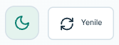

**Tema:** Koyu ekrandaki güneş açık temaya; açık ekrandaki ay koyu temaya geçirir. Simge mevcut temadan çok yapılacak geçişi anlatır. Tercih aynı tarayıcı profilinde saklanır.

**Metin boyutu:** Detay panelinin yazı boyutu kontrolü yalnızca o paneli etkiler. Tarayıcı yakınlaştırması ise bütün sayfanın görünümünü etkiler.

**Tab / Shift+Tab:** Odaklanabilir kontroller arasında ileri/geri gezinir. **Enter / Boşluk:** Standart düğmeyi ve destekleyen kayıt satırını etkinleştirir. **Ok tuşları:** Odak uygun açılır liste veya zaman sürgüsündeyken değeri değiştirebilir. Kısayolların etkisi odaktaki öğeye bağlıdır.

**Simge düğmeleri:** Üzerlerine gelindiğinde varsa açıklama ipucu görünür. Erişilebilir adlar klavye ve ekran okuyucuyla ayırt etmeye yardımcı olur; bütün görsel simgeler etkileşimli değildir.

**Yerel olarak saklananlar:** Tema, detay yazı boyutu, ses/otomatik kamera tercihi, izleme listesi ve bildirim bilgileri tarayıcı profiline bağlıdır. Farklı cihazların otomatik olarak aynı tercihleri paylaşması beklenmemelidir.

**Geçici görünüm durumları:** Arama, filtreler, açık paneller ve oynatma gibi durumlar yeniden yükleme veya ilgili bileşenin kapanmasıyla sıfırlanabilir. Kalıcı ayar oldukları varsayılmamalıdır.

**Sunucuya yazan kontroller:** İnsan onayı ayarı, karar kaydetme/güncelleme/geri alma ve değerlendirme işlemleri yerel görünüm ayarları değildir. Bu kılavuz hazırlanırken bunlar çalıştırılmadı.

## 19. Kapsam ve ekran görüntüleri

**Doğrulama yöntemi:** Görseller çalışan uygulamadan ayrı bir Playwright tarayıcı profilinde alındı. Sunucuya yazan istekler ve yeni PDF üretim isteği çekim betiğinde engellendi. Engellenen bir istek tetiklenmedi ve tarayıcı JavaScript hatası kaydedilmedi.

**Güncellik:** Görseller 26 Eylül 2026 tarihinde 1600 × 1000 pencere boyutunda alındı. Ekran ölçeği, veri ve kayıt seçimi değiştiğinde sayılar, metinler ve bazı kontroller farklı görünebilir.

**Koşullu kontroller:** Boş onay paneli, boş bildirim listesi ve görünmeyen sesli uyarı kartı için örnek veri üretilmedi. Kaynak koddan doğrulanan koşullu düğmeler ilgili bölümde ayrıca belirtildi.

**Sınırlar:** Bu belge arayüzün mevcut işlevlerini tanıtır. Algoritma eşikleri, risk seçimi, kişilere yönelik çıkarım veya müdahale yöntemleri tarif edilmez. Ekrandaki mevcut etiketler, sonuç doğruluğuna ilişkin bağımsız bir doğrulama değildir.

**Düzenlenebilir kaynak:** Kılavuz metni, PDF üreticisi, ekran yakalama betiği, kontrol envanteri ve görseller aynı dokümantasyon klasöründedir. Uygulama bileşenleri değiştirilmemiştir.
